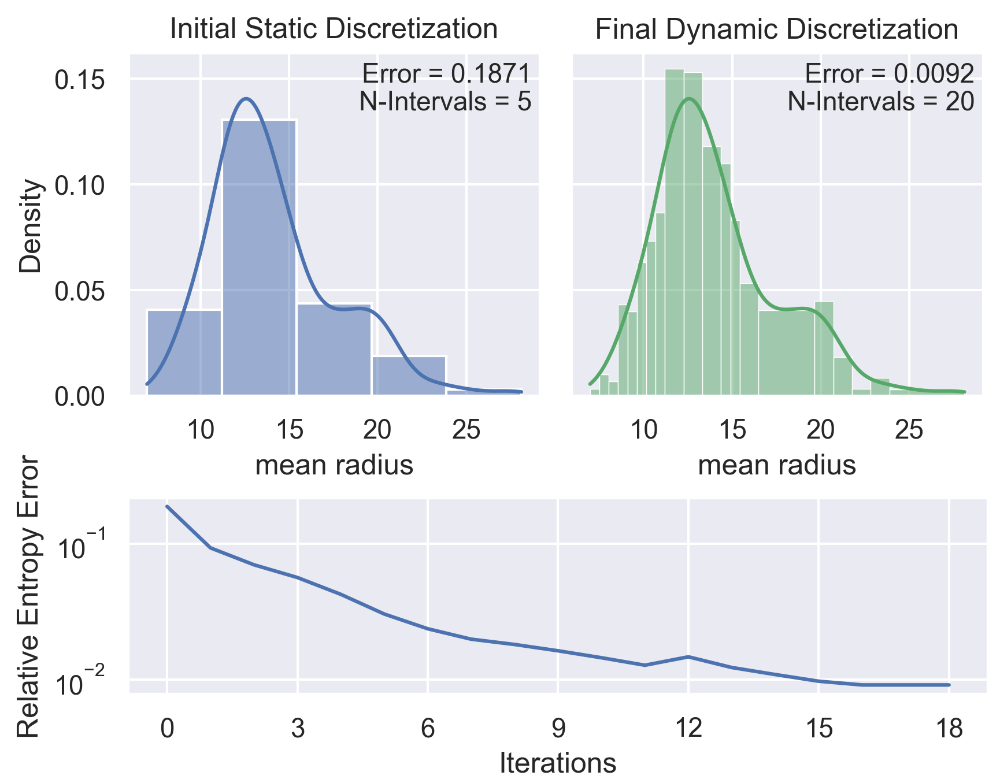
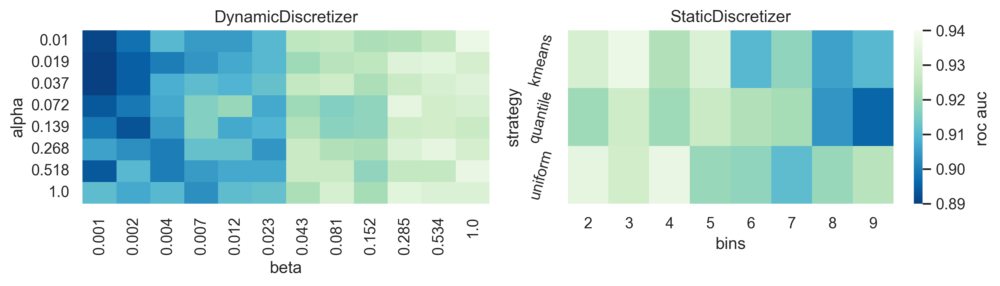

# Dynamic Data Discretization

Dynamic discretization toolkit in Python based on the work by Fenton and Neil. This library provides classes for performing both static and dynamic discretization on data, as well as a handful of custom Bayesian networks defined using PyAgrum for testing. There is additional functionality for visualization of the resulting discretizations.

## Example Results

Initial static (top-left) and final dynamic (top-right) discretization intervals for five-interval starting condition, with relative entropy error across all iterations (bottom). Solid line overlaid on discretization intervals represents the underlying distribution approximated with KDE.

ROC AUC score comparison for ACCEL clinical trial data across the parameter space for dynamic and static discretization techniques.

